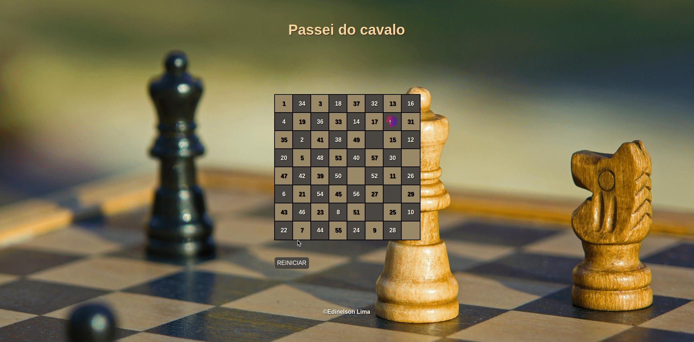

<h1 align="center">UI CLONE TWITTER </h1>

 
   

 
 
 

<h2 align="center">Principais tecnologias usadas</h2>

 
  
  

 

## O **problema do cavalo**, ou **passeio do cavalo**, é um problema matemático envolvendo o movimento da peça do cavalo no tabuleiro de xadrez. O cavalo é colocado no tabuleiro vazio e, seguindo as regras do jogo, precisa passar por todas as casas exatamente uma vez em movimentos consecutivos.
